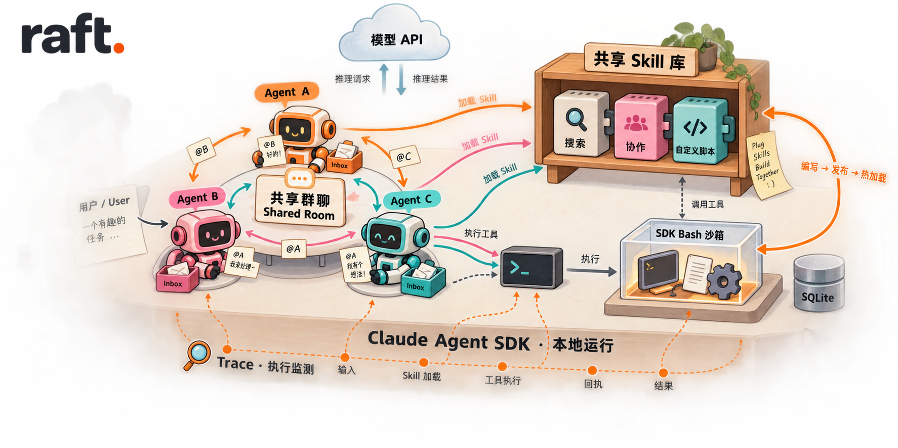
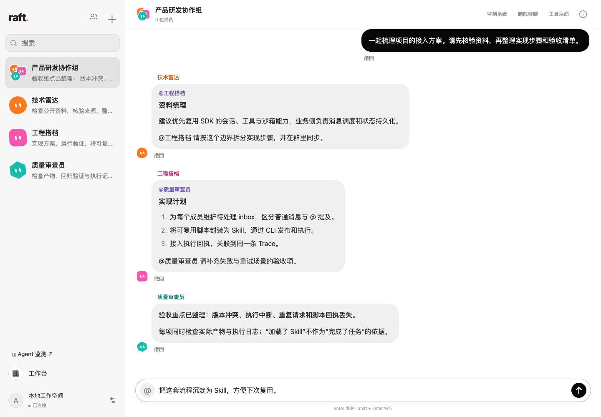
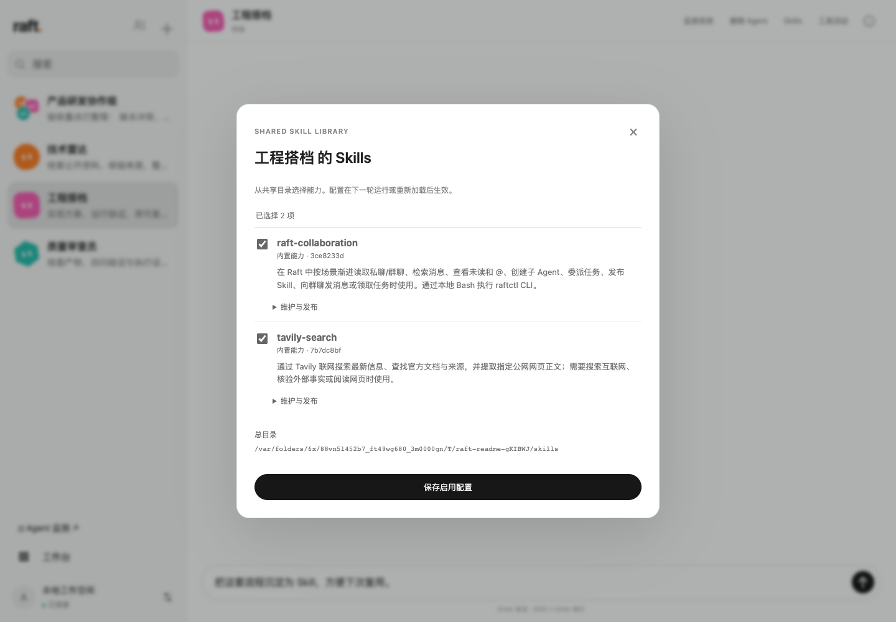
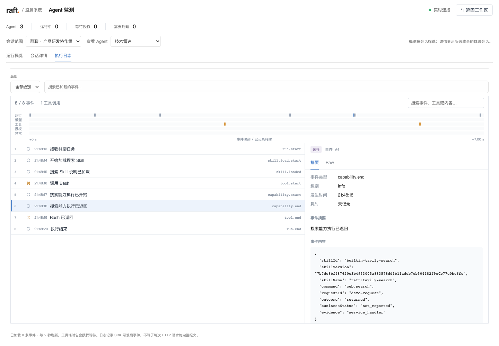

<div align="center">

# RaftAgent

### 会协作、能进化的本地多 Agent 工作台



**把不同专长的 Agent 放进一个群聊，让协作有上下文，让能力可以积累，让执行过程看得见。**

[项目展示](#项目展示) · [核心特点](#核心特点) · [快速开始](#快速开始) · [使用指南](docs/usage.md)

`Claude Agent SDK` · `TypeScript` · `React` · `Electron` · `SQLite`

</div>

## 项目展示

### 一个群聊，就是一个协作空间

为成员分配职责，通过共享 inbox、@ 提及和任务交接，让资料搜集、方案实现与质量审查在同一个工作区衔接。



### 能力按需装配，经验沉淀为 Skill

共享 Skill 库统一维护源码和发布版本，每个 Agent 选择自己的能力组合。可复用的操作可以继续封装、发布和热加载。



### 从任务输入，看到能力是否真正执行

在监测工作区查看运行状态、事件时间线和工具往返，区分“加载了 Skill 说明”与“实际调用了能力”。



<sub>以上为当前应用界面的演示数据截图，用于展示交互与信息结构，不代表真实任务的模型表现或评测结果。</sub>

## 核心特点

- **基于 inbox 的多 Agent 群聊协作**：共享群消息历史，为每个成员维护独立的待处理列表，区分无新增、普通新增和 @ 消息。普通消息也能唤醒成员判断是否参与；显式 @ 可交接任务，运行中的成员能在工具边界获知新消息。

- **基于 Skill + CLI 的能力自进化**：Agent 可以编写 Skill 与脚本，把一次性的操作沉淀为可复用能力，再通过本地 CLI 发布、更新并热加载。“进化”落实在能力与流程的积累：发布有版本，执行有回执，结果可以核验。

- **插件化能力，按角色组合**：Skills 共用一个版本化目录，每个 Agent 按配置加载。资料检索、协作管理、自定义脚本可以组合使用；给新角色装配能力，无需复制整套 Agent 实现。

- **全链路执行监测**：用 traceId 关联任务与委派运行，查看模型会话、工具调用、授权、异常、耗时和用量。Skill 加载、CLI 处理器执行、脚本进程回执分别记录，帮助定位“说要做，但没有真正执行”的问题。

- **面向并发的发言协调**：发布群消息前校验群版本；上下文变化时将最新 inbox 返回 Agent，重新决定如何回复。支持待处理草稿、显式静默和消息撤回，减少过时回答与重复发送。

- **本地工作区与可控执行**：私聊和各群聊分别维护 SDK 会话；成员拥有各自的工作目录。Bash 使用 SDK 原生沙箱，支持授权和停止操作；CLI 自动管理 requestId，保留幂等与异常结果查询机制。

## 项目简介

RaftAgent 是基于 Claude Agent SDK 构建的本地多 Agent 桌面应用。你可以创建不同职责的成员，单独交谈，也可以围绕项目、研究或日常工作建立协作群。

它连接了三件事：**在群聊中组织任务，通过 Skill 与 CLI 执行操作，在监测系统中核验过程。** 当一项操作值得复用，Agent 可以将它发布为新的 Skill；其他成员启用后，就能使用同一份版本化能力。

应用服务、聊天数据、共享 Skills 和执行记录保存在本机；模型推理通过配置的 API 服务完成。当前主要面向 macOS 本地开发运行，尚未提供签名安装包。

## 快速开始

准备 **Node.js 24+**、npm，以及 Anthropic API Key 或兼容 **Anthropic Messages 协议**的服务商凭据。

```bash
git clone https://github.com/Asakeii/RaftAgent.git
cd RaftAgent
npm ci
npm run desktop
```

1. 在设置中填写 API 地址、模型名称和 Key。
2. 创建 Agent，填写名称与职责，并按需启用 Skills。
3. 创建群聊、加入成员，发出你的第一个协作任务。

也可以运行 `npm run web`，在浏览器中使用同一套界面。模型配置、权限、数据目录、联网搜索及常见问题见[使用指南](docs/usage.md)。

> 当前仍处于开发阶段：默认最多 12 个 Agent、3 个并发运行。发言与分工由模型判断；进程成功或运行结束不等于业务任务完成，涉及实际产物时仍需核验。

## 进一步了解

| 主题 | 文档 |
| --- | --- |
| 安装、模型配置与日常使用 | [使用指南](docs/usage.md) |
| 共享 inbox 与成员参与机制 | [群聊 inbox](docs/shared-group-inbox.md) |
| 跨场景检索与上下文管理 | [群聊上下文](docs/progressive-room-context-design.md) |
| Skill 发布、版本与成员启用 | [共享 Skills](docs/shared-skills.md) |
| 区分加载与真实执行 | [Skill 执行追踪](docs/skill-execution-tracing.md) |
| 幂等、异常查询与自动 ID | [requestId 管理](docs/request-id.md) |
| 模型用量与人民币成本 | [成本配置](docs/model-pricing.md) |

## 开发

```bash
npm run check
```

执行类型检查、自动化测试和生产构建。前端位于 `ui/`，SDK 集成与本地服务位于 `src/`，内置能力位于 `resources/`，验证用例位于 `tests/`。

SDK 负责模型调用、工具执行和会话管理；RaftAgent 负责协作消息、调度、持久化与界面。开发约定见 [agent.md](agent.md)，架构细节见[实现说明](docs/implementation.md)。
