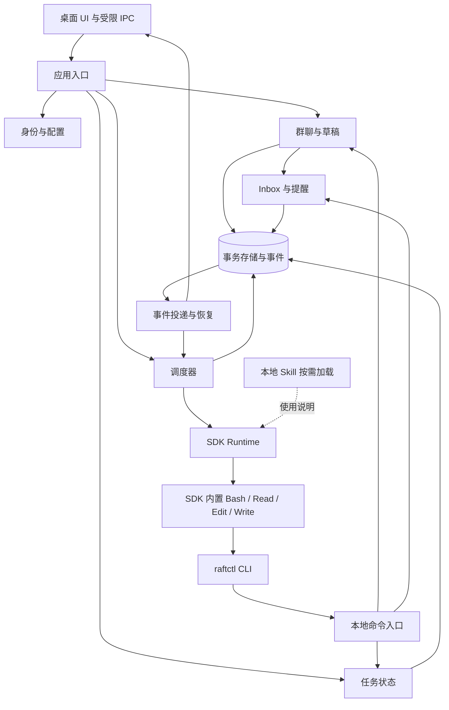

# Claude Agent SDK 多 Agent 桌面 Demo：模块设计

2026-09-14：本地助手 v0.1 已实现并完成 SDK/CLI/桌面验证。当前能力及尚未交付的设计项以 [实现记录](implementation.md) 为准；本文其余内容保留原设计讨论上下文。

日期：2026-09-12。状态：设计稿，不代表代码已实现或真实模型验证已通过。

本轮已确认接入约束：**不接入 MCP；参考 Pi，以本地基础工具执行 CLI，通过 Skill 渐进披露 CLI 的使用方法。** 本稿已据此替换上一版的协作 MCP 设计。继续使用 Claude Agent SDK，不切换到 Pi 运行时。文中的 `view_inbox` 等旧名称表示业务动作，具体调用入口以本稿的 `raftctl` 子命令为准，不注册成模型工具。

用户所说的 Claude ADK 在本项目中指 `@anthropic-ai/claude-agent-sdk`。本次核对：Node v24.14.0；依赖声明、lockfile 与安装包均为 SDK 0.3.267。遵循 [agent.md](../agent.md)；产品已确认规则以 [multi-agent-design.md](multi-agent-design.md) 为准；桌面总体结构见 [desktop-assistant-architecture.md](desktop-assistant-architecture.md)。

## 1. 范围与核心选型

Demo 建议包括两个独立主 Agent、一个工作群、直接会话、工具活动、inbox、显式任务状态、held draft 验证和基础重启恢复。Held draft 纳入本 Demo 是本稿建议，原设计中的首版范围不因此自动改为已确认。争议暂停/投票/答询设计为后续扩展模块，不能把尚未实现的部分显示为可用功能。

- 每个主 Agent 使用应用管理的独立 `query` / SDK session。原生 `agents` 子代理适合父 Agent 委派任务，但不会替应用建立具有独立用户入口、群成员资格和生命周期的主身份，因此不把所有主成员挂在一个总控 Agent 下。
- SDK 管模型调用、Agent 循环、内置工具和会话 transcript；应用管成员、任务、消息、唤醒、状态与执行归属。
- Demo 每个主身份一个主 SDK session；私聊和多个房间的 inbox 共用该身份的工作上下文。对其他成员只公开显式群消息及本房间活动，不复制私聊 transcript。若需要跨房间上下文隔离，应另建工作身份/会话。
- 一次 Run 绑定固定的执行来源和任务。群任务绑定 roomId，私聊 Run 的 activityRoomId 为空；不根据当前选中的 UI 标签改变输出归属。
- 建议每次调度使用一个流式输入 query，只投递一个应用工作输入；一轮完成并关闭后，下次通过明确 session ID 恢复。保留流式模式以使用 `interrupt()`，避免预先向 SDK 排入大量未来输入。进程常驻优化不作为 Demo 前提。
- Demo 代码任务采用 A 写入、B 审查；验证命令由宿主固定执行并登记结果。B 需要用 Bash 调用 CLI，因此“只提供 Read 工具”已不足以保证只读；协作命令权限由本地服务检查，文件写入限制需要 SDK 沙箱/操作系统约束及实际验证，不能仅靠 Bash 字符串前缀判断。多写入者的工作区隔离与合并是单独能力。

## 2. 模块与依赖



状态机等逻辑模块放在一个 Node 服务内，不拆网络微服务。CLI 是独立短进程，通过 Unix domain socket 向该服务提交命令；CLI、UI 和 SDK 都不直接写业务表。Outbox 在事务提交后触发调度，不让群消息事务同步等待另一个 Agent 完成。

建议文件组织（以下为计划路径，不表示已经创建）：

```text
src/
  cli.ts                         # CLI 输入输出入口，区分运行 Agent 与 raftctl 命令
  agent.ts                       # SDK query 执行入口及生命周期
  config.ts                      # 环境和 SDK Options 配置
  app.ts                         # 装配模块与服务生命周期
  contracts.ts                   # UI/服务与领域命令的公共类型
  agents/registry.ts             # 身份、配置版本、session 映射
  runtime/scheduler.ts           # 单实例、输入队列、停止与恢复归属
  runtime/sdk-events.ts          # SDK 输出映射，不执行群消息业务
  runtime/hooks.ts               # 工具生命周期与边界提醒
  collaboration/room.ts          # 群聊成员、消息与版本
  collaboration/drafts.ts        # Held draft 状态转换
  collaboration/inbox.ts         # 接收者消息、显式确认和提醒批次
  collaboration/tasks.ts         # 任务状态与验收证据
  control/commands.ts            # raftctl 子命令、参数和返回对象；输入输出由 cli.ts 处理
  control/client.ts              # CLI 到本地服务的 socket 客户端
  control/server.ts              # Run 绑定、命令校验与业务路由
  skills/loader.ts               # 准备本地 Skill 路径，复用 SDK 发现机制
  storage/database.ts            # 数据库迁移、事务与查询
  storage/outbox.ts              # 提交后的 UI 通知与调度信号
  recovery.ts                    # 启动恢复与未知执行结果核验
  desktop/main.ts                # Electron 窗口与服务进程管理
  desktop/preload.ts             # 受限 IPC API
  ui/                            # React 会话、房间和状态视图
tests/
  domain/                        # 状态转换、幂等、并发条件
  runtime/                       # SDK 适配器与真实 SDK 接入验证
  fixtures/login-project/        # 独立 Demo 项目
resources/skills/raft-collaboration/
  SKILL.md                       # 简明入口、触发场景和工作流
  references/inbox.md             # 收件箱、确认和分页
  references/messages.md          # 房间版本与草稿操作
  references/tasks.md             # 领取、提交和审查
```

这要求后续拆分 Node/Electron 与 React 的 TypeScript 构建配置；当前 tsconfig 仅覆盖 Node `.ts`，不能直接声称已有 JSX 构建支持。Electron 携带的 Node 版本需核对；建议 Node 24 服务进程承载 SDK 与数据库，桌面壳只负责桥接。

## 3. 身份与配置模块 AgentRegistry

**职责**：定义“谁在工作”，保存持久身份、角色与明确 session ID。它不启动 query，也不计票。

```ts
type AgentProfile = {
  id: string;
  name: string;
  rolePrompt: string;
  workspaceId: string;
  configVersion: number;
  permissionProfile: "implementer" | "reviewer";
  model?: string;
};

type SessionBinding = {
  agentId: string;
  sdkSessionId: string;
  configVersion: number;
};
```

候选接口：`createAgent`、`getProfile`、`bindSession`、`getSessionBinding`、`deriveSdkOptions`。

复用 `config.ts` 的环境校验，保留继承环境变量，密钥只留在服务端。每次启动明确传入 cwd、角色、本地内置工具、Skill 来源、hooks、模型及预算，不假定 resume 会替应用完整恢复配置。协作 CLI 在宿主设置的 PATH 中，连接本次 Run 的能力凭据通过宿主环境传入，不让模型手写或复制到命令参数。

基础内置工具用 `tools` 配置；自动批准用 `allowedTools`；它们不是同一个概念。`canUseTool` 只承接没有被更早规则处理的权限询问，不是每次工具的检查入口。每次检查需求应使用已核实的 PreToolUse 并结合工具服务校验。

Agent A/B 均有自己的 SDK session，不用 `continue: true` 从目录猜测最近会话。收到 init 时尽早记录 session ID，result 再校验；启动失败没有 ID 时保留失败状态，不伪造会话。

## 4. SDK 执行模块 AgentRuntime

**职责**：将一次应用调度转成 SDK 执行，消费真实事件，关闭资源。它不判断消息是否过时、任务是否审查通过。

```ts
type RunContext = {
  runId: string;
  agentId: string;
  generation: number;
  inputId: string;
  source: "direct" | "room" | "inbox-check";
  activityRoomId: string | null;
  taskId: string | null;
};

// 设计接口，非 SDK 原生方法。
interface AgentRuntime {
  start(context: RunContext, input: string): Promise<RunOutcome>;
  stop(runId: string): Promise<StopOutcome>;
}
```

`RunOutcome` 至少区分正常结束、用户停止、预算/轮次耗尽、SDK 错误与结果未知。所有输出携带 runId 和 generation，拒绝旧运行的迟到状态更新。

生命周期：加载身份/绑定 → 准备 CLI、Skill 与本次 Run 的本地服务连接信息 → 注册 hooks → 构造 `AsyncIterable<SDKUserMessage>` → `query` → 记录 init → 消费消息与工具事件 → 记录 result 或异常 → finally 关闭输入通道与 Query 并撤销本次 Run 连接凭据 → 通知调度器收尾结果。

本 Demo 每个 query 只提交一个工作输入，因此收到对应 result 后可以结束本次 Run；若以后让一个 query 承载多个输入，必须重做结果关联，不能继续沿用当前 CLI 遇到首个 result 就 return 的逻辑。

SDK 字段适配：

| SDK 输出 | 应用含义 |
| --- | --- |
| system/init 的 session_id | 持久化会话关联 |
| stream_event | 直接会话的临时流式展示，按消息/内容块关联 |
| assistant | 完整消息的权威展示版本，合并已有增量而非再追加一份 |
| assistant 中的 tool_use | 工具调用请求，不证明执行已经发生 |
| tool_progress | 有该事件时补充执行进度；不能假设所有短工具都有此事件 |
| user 中的 tool_result、PostToolUse/Failure | 工具结果对账 |
| result | 一轮 SDK 执行结果，不等于整个业务任务完成 |

SDK assistant/result 默认进入该身份的直接会话或运行详情。群聊正式发言只能由 Bash 执行 `raftctl room send` 提交；不能把流式文本边生成边公开，再在最后做 held draft 检查。

停止：先在应用里保存 user-stop 阻塞，再请求流式 Query `interrupt()`；处理可能的中断回执和排队输入，最后关闭。关闭/中断成功不证明外部动作回滚。收尾不确定时进入 recovery_required；未确认旧实例结束前不启动新实例。

## 5. 调度模块 AgentScheduler

**职责**：决定某个主身份是否可以开始、是否需继续检查 inbox；保证只有一个执行实例。模型不能自己跳过它启动第二个主 query。

接口：`enqueueUserInput`、`requestInboxCheck`、`requestStop`、`resumeByUser`、`onRunSettled`。

```text
idle -> starting -> running -> idle
starting/running -> stopping -> stopped
starting/running/stopping -> recovery_required
```

主执行状态与暂停原因分开存储：`user-stop`、未来的 `discussion:D1` 等。自然 idle 可以被消息唤醒，stopped 不可以。解除一个原因不清空所有原因。

执行规则：

1. 输入先持久化；在短事务中按 agentId 获取运行归属、分配 generation。
2. 本身份已经 starting/running 时，不新建实例。直接输入留在应用队列；群消息留在 inbox，并更新待提醒代次。
3. 执行期间不预先把后续直接输入排入 SDK；已运行 Agent 的群提醒通过 hooks 合并提供。
4. 正常收尾后，在同一身份串行处理范围内重新检查新消息/待办及阻塞，避免“刚退出时收到消息”的丢唤醒。
5. 同一输入 ID 不重复执行；提交过但接收结果不确定的输入需要对账，不能当作没执行过。

只有 inbox-check 的无房间 Run 不自动公开任何工具活动。其通过 inbox 发现任务后，可登记领取并由调度器安排带 taskId/roomId 的后续 Run；工作 Run 中只处理当前任务，跨任务请求记录待办并在后续 Run 执行，避免活动被错误投影到原房间。

新消息可唤醒但不强制回复。自己的群消息不生成自己的唤醒记录；activity、已读确认和内部调度事件不触发聊天唤醒。SDK 单 Run 的 maxTurns/maxBudgetUsd 之外，还需要演示会话累计额度，防止无限互相回复跨 Run 绕过预算。

## 6. 群聊与草稿模块 RoomService / DraftService

**职责**：成员关系、公开消息、协作版本及草稿生命周期。它不运行模型。

Room 保存 id、成员、生命周期、coordinationVersion。公开消息保存发送身份、正文、@ 列表、taskId、提交版本及顺序。版本由服务分配，不接受模型任意覆盖。

主要命令：`createRoom`、`addMember`、`sendMessage`、`resolveDraft`、`readRoomChanges`。所有读取/发送都检查成员与可见范围，离开房间后的读历史政策在产品中另定，不能默认拥有全部权限。

`sendMessage({ roomId, basedOnVersion, body, mentions, requestId })`：

1. 校验宿主绑定身份、成员资格、正文及 @ 目标。
2. 查询幂等结果；同 requestId 同载荷返回首次结果，不同载荷报冲突。
3. 在一个事务中比较 coordinationVersion。
4. 相同则提交消息、递增版本、生成接收者 inbox 与 Outbox；不同则保存 held 草稿，不发正式消息、不唤醒成员。
5. 返回 committed，或 held 的 draftId、最新版本、变化摘要/查询游标和可选动作。

`resolveDraft` 支持 revise、retry-as-is、discard、force。前两者必须携带重新依据的版本并再次检查；force 仍检查身份、成员与内容权限，只越过新鲜度检查，并记录被告知的版本变化。重复操作受草稿状态和命令 ID 约束，不能一份草稿发两次。

`eventSeq` 记录全部持久事件，供 UI 续传；coordinationVersion 仅由正式聊天、成员、任务安排及决定等相关事件推进，工具 activity 不推进。用户提交的新消息直接成为新的房间事实；Agent 的草稿检查适用于生成后再提交的发言。

## 7. Inbox 模块 InboxService

**职责**：每个接收者“有什么可读、确认了什么、哪些新增需要提醒”。群消息存一份，接收记录按成员独立保存。

接口：`listInbox`、`ackMessages`、`getNotice`、`reserveNotice`、`recordNoticeEvidence`。普通成员消息和 @ 都可进入 inbox；@ 影响优先显示，不是唯一参与入口。

```ts
type InboxNotice = {
  noticeId: string;
  arrivalGeneration: number;
  unreadMentionCount: number;
  unreadOtherCount: number;
};
```

读取返回消息 ID、发送者、正文、房间、时间及该读取快照的房间版本；多房间分别返回版本，不能有一个跨房间通用版本。分页使用稳定排序游标，ackMessages 精确更新指定 ID，不按最大 ID 清空此前所有消息。

提醒生成依赖新增代次，不依赖未读数量差值。例如读掉一条同时收到一条，数量相同仍有新消息。提醒本身不推进已读。

将提醒阶段分成待提醒、已尝试注入、已有接收证据。Hook 返回上下文只能登记投递尝试，不能声称模型已经理解。`raftctl inbox list --notice-id ...` 可携带 noticeId 作为后续接收证据；不能因预留提醒批次就在数据库清除未读。

正常运行中已尝试注入的同一批次不在每个 Hook 重复注入；失败可明确重排。重启时尚无接收证据的批次允许保守补送，属于至少一次提醒而非恰好一次。已有接收证据且无新增时不再次催读。该确认协议是本稿提出的实现方案，须用真实 SDK 验证。

## 8. 本地 Tool、CLI、Skill 与 Hooks 模块

### 8.1 参考 Pi 的边界

Pi README 的默认工具为 read、write、edit、bash，并明确建议用 CLI + README/Skills 扩展能力。Pi 同时存在 `pi.registerTool()` 扩展接口，但它属于 Pi，不是 Claude Agent SDK 的 API。

本次核对 Claude SDK：`Options.tools` 配置内置工具名称；公开 `tool()` 的注册路径仍通过 `createSdkMcpServer()` 和 mcpServers。因此本设计不使用该 helper，也不假造 `registerTool`。选用原生 Bash 调用本地 CLI，Read/Edit/Write 处理文件，Skill 加载使用说明，继续复用 SDK 的整个执行循环。

### 8.2 CLI 模块 RaftControlCLI

**职责**：命令发现、参数解析、向本地服务提交请求，以及格式稳定的结果输出。CLI 是能力入口，不维护模型循环，不直接打开业务数据库。

命令约定如下，名称和参数为待实现契约：

| 命令 | 关键参数 | 对应模块 |
| --- | --- | --- |
| raftctl inbox list | --room?、--cursor?、--limit、--notice-id? | Inbox 查询，旧称 view_inbox |
| raftctl inbox ack | --ids、--request-id | 指定消息确认 |
| raftctl room changes | --room、--after-version、--cursor? | 房间变化 |
| raftctl room send | --room、--based-on、--body/--body-file、--mention?、--request-id | 正式消息/held draft |
| raftctl draft resolve | --id、--action、--based-on?、--body-file?、--request-id | 修改、重检、丢弃、显式强制 |
| raftctl activity report | --text、--request-id | 本次 Run 绑定的公开摘要 |
| raftctl task list | --room | 任务查询 |
| raftctl task claim | --id、--expected-version、--request-id | 领取及后续调度 |
| raftctl task submit | --id、--expected-version、--input-json -、--request-id | 产物及审查请求 |
| raftctl task review | --id、--expected-version、--input-json -、--request-id | 审查结果及证据 |
| raftctl request status | --id | 连接中断后查询是否已提交 |

所有命令支持 --help；业务命令支持 --json。复杂文本使用 stdin JSON 或 `--body-file -`，避免把长消息和特殊字符直接拼接进 shell。CLI 将解析后的结构化数据发送给本地服务，服务不执行请求正文中的 shell。

stdout 在 --json 下只输出一个有 schemaVersion 的 JSON 对象；诊断写 stderr。结果至少有 requestId、ok、status、data/error。held 是正常结果：`ok: true, status: "held"`，带 draftId、当前版本和允许动作。命令进程 exit 0 表示获得有效业务结果，不等于消息已发送，更不等于任务完成。

建议 exit 2 表示输入错误、3 表示命令被业务规则拒绝、4 表示通信或服务异常。通信异常可能发生在服务已提交之后，须用原 requestId 查状态或重试同一请求；不能换 ID 再发。所有写命令要求稳定 requestId，同 ID 不同载荷拒绝。CLI 自己不盲目重试写操作。

### 8.3 本地命令服务 LocalControlServer

**职责**：将 CLI 请求绑定到真实 Run，检查权限和状态，调用 Room/Inbox/Task 等模块。

macOS Demo 使用 Unix domain socket，传输版本化、有长度限制的结构化请求/响应；这是应用内部 IPC，不注册 MCP server，也不向模型提供 RPC schema。UI 可复用同一业务层，但拥有独立的人类用户身份入口。

宿主启动 Run 时生成有作用域的短期能力凭据，绑定 agentId、runId、generation、角色与房间范围。CLI 从宿主设置的环境读取连接信息，服务根据凭据取得身份；忽略或拒绝请求体自称的发送者。凭据不写进 Skill、聊天、命令参数或日志，Run 结束时撤销；过期 Run 的新写请求拒绝。历史 request status 的恢复查询由宿主受控完成。

同一 OS 用户下的自由 Bash 不能仅靠环境变量或 socket 路径形成强 Agent 隔离；身份绑定可防止普通参数冒充，强隔离仍须沙箱/进程权限配合。Demo 不把这套连接凭据声称为对恶意同机代码的安全边界。

与先前 MCP handler 的不同点在于跨进程连接；事务、幂等、成员检查和任务校验仍只在服务端实现一份。Skill 中的约定帮助模型正确使用，不替代服务检查。

### 8.4 Skill 模块 CapabilityGuide

**职责**：渐进披露 CLI 的使用方法，不持有状态、不执行命令、不作为权限规则。

加载层次：启动时发现 name/description → 需要协作时调用原生 Skill 加载 SKILL.md → 只在遇到具体操作时阅读 references → 不清楚参数时调用 `raftctl <subcommand> --help`。

初版建议一个 `raft-collaboration` Skill，包含收件箱、群消息、任务、活动和草稿的简要入口；详细协议放 references，避免每个命令都成为一个 Skill 或把全部帮助放到 system prompt。

SDK 原生发现依赖本地文件。Demo 将发布资源复制到受控示例项目的 `.claude/skills/raft-collaboration/`，使用 `settingSources: ["project"]`、`skills: ["raft-collaboration"]`，并在显式 tools 列表中包含 Skill。项目来源还会加载其他项目设置，因此示例目录须受应用管理；以后面向任意项目可核验显式本地插件路径只加载应用资源，不引入 MCP。

当前代码 `settingSources: []` 不会自动启用这套项目 Skill，后续实现需实际修改并验证。`skills` 是可见性过滤，不是文件沙箱。每次 Run 记录 Skill 版本及 CLI 契约版本，运行期间不覆盖其说明；CLI 不兼容版本应明确拒绝。

SKILL.md 应说明：

1. 什么时候检查 inbox、如何只确认实际读取的 ID。
2. 读取房间版本后再发送；held 后先了解变化，不自动 force。
3. 领取成功才按任务执行；提交不等于完成。
4. 活动是一句话公开说明，不广播原始工具输出。
5. 写命令固定 requestId，通信失败先核验结果。
6. 没有需要回复的内容时保持沉默。

Skill 的 name/description 负责发现，主提示仅要求“参与协作前加载 raft-collaboration，并通过 raftctl 操作群聊”，不重复整份说明。是否已加载以 SDK 事件验证，不能假设模型一定会选择 Skill。

### 8.5 Hooks 与活动观测

- PreToolUse：验证本 Run 仍有效，登记本地工具请求；不把请求冒充执行成功，也不把一般 Bash 前缀匹配当作完整权限判断。
- PostToolUse / PostToolUseFailure：记录真实工具结果，按 runId + toolUseId 对账。
- PostToolBatch：每批工具解决后合并轻量提醒，如“有 1 条未读 @，请执行 raftctl inbox list --json”；不是暂停 API。
- UserPromptSubmit：候选的开轮提醒入口，与初始输入去重。

工具层看到的是 Bash，业务层知道执行了哪条 raftctl 命令。因此 CLI 服务记录 command.started/committed/rejected/held 事件；业务状态以这些事件及数据库结果为准，不能从 Bash 输出文本或命令字符串猜测。若要关联 SDK toolUseId，需验证实际可用的调用关联机制；第一版分别保留 runId + commandId 和 runId + toolUseId，不声称任意并行 Bash 已精确一一映射。

普通 Read/Edit/Bash 工具活动仍由 SDK 事件显示。活动命令本身不再额外生成一条同义业务活动；原始 Bash 日志保留在可折叠运行详情，避免重复刷屏。终端输出可能被截断，因此查询提供分页和短摘要，不能依赖巨大 stdout 承载完整房间历史。

使用 additionalContext 传轻量通知，不将同伴文字放进表示用户授权的 classifierContext。是否已读、是否提交、是否完成始终由独立业务事实记录。

## 9. 任务模块 TaskService

**职责**：确定负责人、工作版本、审查过程与完成证据。自然语言承诺、SDK result 和数据库任务状态彼此独立。

```text
pending --claim--> working --submit--> reviewing --验收满足--> done
                      ^                   |
                      +-----需修改--------+
```

任务记录 roomId、description、ownerId、reviewerId、version、artifactRefs、verificationRefs、review。主键与条件更新保证只有一个领取者获胜；领取后创建待调度工作输入，与任务更新一起提交。CLI 不直接修改这些字段，调用 TaskService 执行合法转换。

Demo 使用一个实现者和一个审查者：A 有指定示例工作区的编辑能力；B 承担审查，其文件只读约束需配合 Bash 沙箱验证。宿主固定运行示例项目测试，将真实执行结果写成 verification 记录；完成条件可固定为“指定审查者通过 + 对应代码版本测试通过”。不能把 A 或 B 自称通过测试当作验证证据。

审查、测试和产物应引用同一可识别代码版本（例如纳入验证范围文件的内容摘要）。测试后有新修改时不能拿旧通过结果完成新版本；测试期间可暂停本任务的写入或针对固定副本运行。此处是产物版本校验，不是已拒绝的裁决语义失效检测。

任务写权限、代码分支合并和一般 shell 沙箱不是同一个问题。Demo 的单写者简化不代表已实现多写者协作；后续需要单独补充工作区隔离或可靠写入协议。

## 10. 事务、事件与恢复模块 Store / Outbox / Recovery

**职责**：原子保存业务事实，并使进程/UI 丢失后能继续读取。单 Node 服务拥有数据库写入，不让 renderer 或每个 SDK 子进程各自开业务写入连接。

建议实体：agents、session_bindings、runs、pending_inputs、rooms、room_members、messages、inbox_receipts、notice_batches、drafts、tasks、verification_runs、commands、events、outbox、pause_reasons。Demo 可以合并物理表，但保留语义区分。

通用命令过程：

```text
验证命令与身份
  → transaction:
      检查 requestId 与载荷摘要
      加载当前状态并执行纯 transition
      保存新状态 + 事件 + 待投递 Outbox + 命令结果
  → commit
  → Outbox 通知调度器和 UI
```

同一个 requestId 重试返回第一次结果；不同内容拒绝。状态版本检查与更新必须在同一事务。Outbox 可重复投递，消费者按事件/输入 ID 去重。UI 重放事件不重新执行工具。

重启恢复顺序：迁移并加载数据库 → 先禁止自动调度 → 对旧 running/starting/stopping 核验进程和工具结果 → 确认归属后释放或标记 recovery_required → 恢复未送 Outbox → 对无阻塞 idle 身份合并唤醒。

进程 PID 不能单独作为归属证明，配合进程生命周期记录、Run ID、启动标识和握手。generation 可以拒绝迟到的数据库写入，但不能阻止已发出的外部命令继续执行；旧实例无法确认停止时不自动创建新实例。

SDK transcript 继续由 SDK 管理；应用只保存 session 映射和 UI 投影等业务数据。数据库备份单独存在不等于会话可恢复。原 SDK session 丢失时显示明确故障，不能悄悄新建空会话并声称“已恢复”。

收尾：query finally 关闭；删除/归档 UI 项不立即删除恢复所需 transcript；已完成 Run 的临时资源按保留策略清理。争议快照等资源等全部引用结束后才能回收。

## 11. 桌面与应用装配模块 Desktop / App

**职责**：提供交互、启动和关闭本地服务，读取服务投影。它不控制数据库状态转换细节。

Renderer 只得到受限 preload API，例如 `createAgent`、`sendDirectInput`、`createRoom`、`sendUserRoomMessage`、`stopAgent`、`resumeAgent`、`getSnapshot`、`subscribeEvents`。身份敏感字段由服务补全；不提供任意 SQL、文件路径读取或 shell IPC。

React 页面：AgentList、DirectChat、RoomTimeline、TaskPanel、AgentStatus、DraftPanel、EventInspector。显示的群活动以原始 Run 绑定为准，不按当前选择的 Agent/群推断。

订阅协议：先取得一致快照及 eventSeq，再请求 `afterSeq` 的后续事件并补齐缺口；必要时重新加载快照。不能“先快照、晚订阅”而遗漏中间事件。文本增量可以临时传输，完整消息与关键生命周期持久保存；重连不承诺恢复每个动画 token。

Electron 窗口关闭策略 Demo 采用显式退出：请求停止全部本应用 Run，等待有界收尾，保存未完成状态，关闭服务与数据库。服务异常时 UI 显示断线/待恢复，不继续显示任务正常运行。Node/SDK 打包版本及 macOS 子进程回收需验收。

## 12. 后续争议扩展模块 DiscussionCoordinator

业务接口保留 `requestDiscussion`、`submitVote`、`askSeat`、`recordUserDecision`；后续映射为 raftctl discussion 子命令。Demo 未实现时不在 CLI 或 Skill 中宣称可用。

依赖现有 Scheduler 的暂停原因机制、Runtime 的原生 fork、Store 的事务登记与独立 SnapshotService。流程继续遵循现有 D01–D53：取得名额 → 固定全应用成员 → 全员暂停确认与位置记录 → 建立固定只读快照 → 分叉独立投票 → 两轮规则/用户裁决 → 登记协调状态与主要参与者通知 → 解除本场暂停。

SDK 复用 `resume + forkSession: true` 和按类型核实的截断位置；不复制 query 对象或进程内存。文件快照由宿主单独建立。投无建议、支持票等待、两场并行暂停归属、固定候选及答询隔离均沿用已确认文档。

PreToolUse 的 defer 可以纳入实验，但官方 Hook 超时存在继续执行情形，且“本批工具结束”不等于“会话完整可恢复快照”。在暂停/分叉集成试验通过前不开放争议功能，不能把一个无限等待 Promise 作为可靠全员暂停实现。

## 13. 端到端调用链

### A 的群消息影响 B

```text
A 加载协作 Skill，再由 SDK Bash 执行 raftctl room send
  → CLI 通过本地 socket 发送结构化命令
  → 服务从 Run 能力凭据取得 A/run/generation，调用 RoomService
  → 事务保存正式消息、B inbox、版本与 Outbox
  → UI 收到消息事件
  → B 已运行：下一工具批次边界得到轻量提醒
    B 空闲：Scheduler 恢复 B 的 session 检查 inbox
    B 停止/暂停：只积压
  → B 用 Bash 执行 raftctl inbox list，读取消息后执行 inbox ack
  → B 根据消息调整当前任务，或登记后续任务
  → B 的实际后续工具调用证明行为发生变化
```

### A 执行工具并显示进度

```text
SDK 决定工具请求
  → PreToolUse 保存 requested
  → 有 tool_progress 时显示 running
  → PostToolUse/Failure 记录真实结果
  → Activity 投影到 Run 绑定的房间
  → 不生成其他成员的聊天唤醒
```

### 草稿遇到新消息

```text
B 读取 roomVersion=10
  → A 提交正式消息，版本=11
  → B 用 basedOnVersion=10 提交
  → 事务保存 held，不公开 B 草稿
  → B 收到变化和选项
  → B 读取新版并修改/重检/丢弃/显式强制发送
```

## 14. 官方证据、验证与开发顺序

本次阅读官方正文，并核对安装的 sdk.d.ts：

| 官方来源 | 核实内容 |
| --- | --- |
| [TypeScript API](https://platform.claude.com/docs/en/agent-sdk/typescript) | query、Options、SDKMessage、内置 tools 与 skills 配置 |
| [Sessions](https://platform.claude.com/docs/en/agent-sdk/sessions) | session ID、resume、fork |
| [Streaming input](https://platform.claude.com/docs/en/agent-sdk/streaming-vs-single-mode) | AsyncIterable 输入与中断场景 |
| [Custom tools](https://platform.claude.com/docs/en/agent-sdk/custom-tools) | 确认公开 tool() 注册仍走 MCP，本设计不采用 |
| [Skills](https://platform.claude.com/docs/en/agent-sdk/skills) | 文件发现、settingSources、skills 过滤、Skill 工具及按需加载 |
| [Hooks](https://platform.claude.com/docs/en/agent-sdk/hooks) | 生命周期、PostToolBatch、additionalContext 和 timeout 边界 |
| [Permissions](https://platform.claude.com/docs/en/agent-sdk/permissions) | allowedTools 非白名单；canUseTool 非每次必经 |
| [Subagents](https://platform.claude.com/docs/en/agent-sdk/subagents) | 原生子代理的独立上下文、父级委派和工具控制 |

Pi 参考：[README](https://github.com/badlogic/pi-mono/blob/main/packages/coding-agent/README.md)、[Skills](https://github.com/badlogic/pi-mono/blob/main/packages/coding-agent/docs/skills.md)、[Extensions](https://github.com/badlogic/pi-mono/blob/main/packages/coding-agent/docs/extensions.md)。本次通过 GitHub API 读取 main；Skills blob 为 `02835f82005407b44887f27bca8517ba58dd624b`，Extensions blob 为 `07277d2778095bd00a74925cf6436e5fa1274ff8`，用于记录查阅时的内容版本。借鉴本地工具、CLI 和渐进披露方式，不引入 Pi 依赖，不套用其独有 API。

本设计选流式输入是为了显式中断控制，不是运行 CLI 的必要条件。应用不配置 MCP server，不使用 SDK tool()/createSdkMcpServer()，也不通过 Hook 虚构工具执行器。禁用发现沿用 `strictMcpConfig: true` 和空 mcpServers，并核验 SDK init 实际工具列表；官方原生消息能力也不能绕过应用的房间检查。

开发顺序：

1. 公共契约 + Store + Room/Draft/Inbox/Task 纯状态转换；测试草稿冲突、单次领取、幂等与接收者已读隔离。
2. raftctl + LocalControlServer；在终端验证命令帮助、JSON、stdin 输入、身份、幂等、held 及提交后断线核验。
3. Registry + Runtime + Skill；用真实 SDK 验证两会话隔离、resume、Skill 发现/加载、Bash 调用 CLI、工具事件及 finally 收尾，并检查实际无 MCP 工具。
4. Scheduler + Recovery；验证并发唤醒、停止、退出交界和未知结果不重放。
5. Desktop/UI；接真实服务事件，验证快照/续传、群隐私边界与工具活动。
6. 固定任务集成验收：B 的消息改变 A 编辑、同版本测试/审查通过、过时草稿稳定复现、重启后状态正确。
7. 独立验证争议暂停/快照/fork 后再接 DiscussionCoordinator。

代码实现后执行项目 `npm run check`。本次仅新增设计文档，不声称已完成运行测试或桌面构建。
