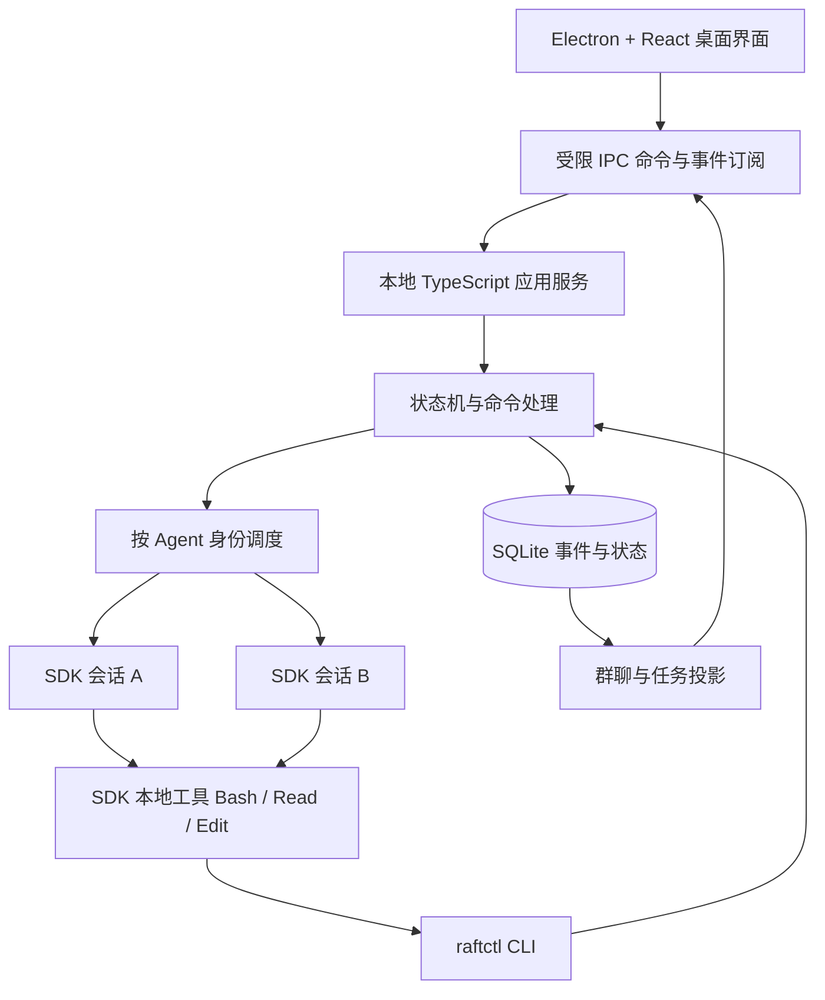

# Raft 协作本地桌面助手：架构与显式状态机

2026-09-14：本地助手 v0.1 已实现并完成 SDK/CLI/桌面验证。当前能力及尚未交付的设计项以 [实现记录](implementation.md) 为准；本文其余内容保留原设计讨论上下文。

日期：2026-09-12。状态：架构建议稿，尚未实现桌面应用或多 Agent 运行时。

最新已确认接入方式：参考 Pi，**本地基础工具 → raftctl CLI → 本地应用服务**，由 Skill 渐进披露命令用法，不接入 MCP。具体模块、CLI 和 Skill 契约见 [Demo 模块设计](demo-module-design.md)。

本次需求：类似 Codex 的本地桌面应用；每个 Agent 拥有独立会话；用户可以创建群聊；群内 Agent 按 Raft 文章的思路协作；执行工具前后可公开简要行动信息；群聊由模型外部的显式状态机维护。

现有已确认规则以 [multi-agent-design.md](multi-agent-design.md) 为准。已核对最新文件：D01–D53、Q37 和 Q38 均有确认记录。本文不覆盖这些规则，不将新技术选型视为用户已确认。尤其不能把群聊建立直接等同于争议投票启动。

## 1. 产品与协作模型

推荐结构：**桌面 UI + 本地应用服务 + 多个独立 SDK 会话 + 持久化协作状态机**。

这里的 Raft 指 [Raft 协作产品文章](https://raft.build/resources/blog/is-having-agents-in-the-room-meant-to-be-chaotic/)，不是 Raft 分布式日志共识算法。单机应用可以由一个本地服务串行提交状态变化，无需为了多个模型实例引入 leader election 或多数派日志复制。

文章明确提供两种交互机制：

- Inbox：消息先保存为可查询条目，Agent 按需读取，不把所有群聊直接推入所有工作上下文。
- Held draft：发送草稿携带其依据的房间版本；版本变化时保留草稿，并让 Agent 选择修改、重新检查后原样发送、沉默或显式越过检查发送。

文章没有给出完整任务调度器、文件并发写入协议或争议投票系统。本文中的状态机、任务登记和桌面结构属于本项目设计。此前讨论的投票与分叉是独立扩展，并非文章所称 Raft 的必要条件。

## 2. 用户看到的应用

- 左侧：项目、Agent 列表、独立会话、群聊列表。
- 中间：当前独立会话或群聊时间线；群聊混合展示正式消息、可折叠工具活动、任务及裁决事件。
- 右侧：群成员、任务归属、Agent 运行状态、当前阻塞原因、待处理草稿、争议进度。
- 底部：输入框、@ 成员、停止、继续、文件附件入口。

用户可以先与 A、B 分别交谈，再创建群聊邀请 A、B。房间本身有历史、成员、任务和状态，不因关闭窗口而消失。UI 只提交命令和展示服务端投影；切换窗口、断开事件订阅不会控制 Agent 生命周期。

### 身份、会话与房间必须分开

| 对象 | 用途 |
| --- | --- |
| AgentIdentity | 稳定身份、角色、配置、权限与预算 |
| WorkSession | 该身份的主工作会话，关联明确的 SDK session ID |
| AgentRun | 一次实际执行，包含 run ID、执行代次与生命周期 |
| DirectConversation | 用户与该 Agent 的交互入口 |
| Room | 成员共享的消息空间与协作事实 |
| DiscussionSession | 争议分叉使用的独立会话与固定来源位置 |

建议初版沿用现有设计：每个主世界 Agent 一个主工作会话，可加入多个房间；群聊通过 inbox 进入该会话，而不是每加入一个群就自动新建一个 Agent。所有直接输入和群聊唤醒经过同一身份调度器。同一 Agent 同时只有一个主世界执行实例。

该方案意味着 Agent 自己可以使用其既有工作上下文；它不意味着将私聊全文分享给群成员。群内只显示明确发布的消息与属于该房间任务的活动。私聊触发的工具调用默认不发布到群；多个房间不能收到互不相关的活动。

如果产品要求“同一角色在不同群里连上下文都必须隔离”，应显式创建不同工作身份/工作会话。这是尚待选择的产品语义，不应隐藏在群聊 UI 中。

## 3. 技术分层



建议 Electron + React + TypeScript 作为桌面选型；Node.js 24+ 服务负责 SDK、数据库、文件访问和运行时管理。Electron 自带 Node 版本必须在选定 Electron 版本后核验，不能假定与开发机一致；必要时为服务打包独立 Node 运行时。Renderer 不直接接触 API key、SDK 或任意 shell 能力。

SDK 已有的 Agent 循环、工具执行和会话上下文管理继续由 SDK 负责。业务能力通过 Bash 执行本地 CLI，Skill 介绍入口与按需参考文档。CLI 通过本地 socket 调用应用服务；服务实现房间成员、消息可见性、持久化任务、状态转换和调度语义。

状态机建议使用带穷尽检查的 TypeScript 状态/事件联合类型与纯 reducer。是否使用 XState 属于可替换实现选项，不是实现显式状态机的前提。

## 4. 群聊时间线：正式消息与工具活动

同一个时间线可以展示不同类型的事件，但它们不能具有相同的调度含义。

| 类型 | 示例 | 对协作的影响 |
| --- | --- | --- |
| chat | “@B，请按统一的错误格式修改接口。” | 写入接收者 inbox，遵循既有普通消息/@ 唤醒规则 |
| activity | “A 准备读取 auth.ts”“读取已结束” | 展示进度；默认不唤醒其他 Agent |
| coordination | “任务 T 已由 B 领取”“裁决已登记” | 对应结构化命令和实际状态变化 |

Activity 不作为普通聊天消息处理，因此不与现有“普通新消息也可唤醒”规则冲突。其他 Agent 如需检查活动，可按任务查询；结果若有协作价值，应由 Agent 明确发布正式消息。

工具活动分两部分：

1. Agent 可用 Bash 执行 `raftctl activity report --text ... --request-id ... --json` 表达公开行动意图，例如“检查登录校验是否遗漏空 token”。任务/房间由 Run 绑定。这是简短说明，不要求暴露内部推理过程。
2. 宿主通过 `PreToolUse`、`PostToolUse`、`PostToolUseFailure` 记录实际工具请求及结果，将可公开字段投影到活动卡片。模型漏报意图时，仍有确定的工具名称和状态作为兜底。

`PreToolUse` 只证明工具准备调用，不证明已经开始执行；随后仍可能被权限规则或其他 Hook 拒绝。展示状态应区分“准备调用、等待授权、已成功、已失败、已取消、结果待核验”，没有执行证据时不伪造“正在执行”。有明确执行事件时才展示运行中。

示例时间线：

```text
你：A 检查登录流程，B 补测试，C 做审查。
A · 活动：准备读取 auth.ts
B · 活动：准备搜索现有登录测试
A：@B，空 token 的返回格式需要先统一。
B · 活动：已查看 1 条 @ 消息
B：我建议复用现有错误对象，避免新增格式。
系统 · 任务：T-02 的负责人为 B，任务状态为执行中
```

活动关联 `agentId + runId + taskId + roomId + toolUseId`；身份与房间由宿主验证。只展示允许公开的摘要，不原样广播工具参数、文件正文、命令输出或凭证。连续重复读取可折叠，但保留原始事件用于排查。

## 5. 外部显式状态机

“外部”指模型上下文之外的应用代码和数据库，不需要额外部署远程服务。Agent 通过工具提出命令；宿主校验身份、权限、版本和状态，决定接受或拒绝。不能从一段自然语言中猜出“已经领取任务”“已完成投票”。

不建议把全部业务挤进一个 `room.status`。一个房间可能同时有 A 执行、B 等待、C 审查和一场争议。应由 Room 聚合维护几个相互关联的状态机。

### 5.1 房间生命周期

```text
active --用户暂停--> paused --用户继续--> active
active/paused --归档--> archived
```

房间暂停不删除消息。候选语义是暂停该房间的新任务派发及相关后续执行，不任意暂停同一 Agent 在其他房间的工作。与争议流程“全应用主世界暂停”的既有规则分开。归档要求本房间无活动执行，或先显式停止并完成收尾；归档动作不能把未完成工具标为成功。

### 5.2 Agent 执行状态

```text
idle -> starting -> running -> idle
starting/running -> stopping -> stopped
starting/running/stopping -> recovery_required
```

暂停原因使用独立集合，例如 `discussion:D1`、`discussion:D2`、`user-stop`，而不是一个布尔值。讨论暂停有 `requested -> quiescing -> acknowledged` 的确认过程；只有当前操作收尾、可恢复位置记录完成、宿主确认不能再推进后，才确认暂停。一个理由解除不能清除另一个理由。

自然完成回到 idle，可以按既有规则被消息唤醒；用户停止后的 stopped 不可以被普通消息自动解除。异常丢失的 run 进入 recovery_required，不伪装成正常 idle。

### 5.3 任务状态

```text
pending -> assigned -> running -> review -> done
running -> blocked -> running
review --需修改--> running
pending/assigned/running/blocked/review -> cancelled
```

这组状态为建议。领取任务必须通过结构化命令，使用数据库条件更新保证一个当前负责人；公开说“我来处理”不等于领取成功。完成任务应登记产物、验证结果与审查依据；工具成功或 SDK 一轮结束都不能直接将任务变成 done。

任务归属也不等于文件锁。多个任务仍可能改同一文件，必须有独立工作区/合并流程，或可强制执行的写入协调。未经验证不能把提示词里的“不要冲突”当作文件并发安全。

### 5.4 消息草稿状态

```text
prepared --版本一致--> committed
prepared --版本变化--> held
held --修改或原样重检--> prepared
held --保持沉默--> discarded
held --显式越过检查--> committed
```

Agent 获得 `roomVersion = 42`，随后生成草稿。如果提交时房间已经是 44，宿主返回 `held + draftId + currentVersion + 变化摘要`，不发布草稿。Agent 可以读取变化后重新选择。强制发送必须为独立显式动作，并留下已告知版本变化与 override 的记录，不由 SDK 重试暗中代劳。

推荐分开两个序号：

- `eventSeq`：所有持久化事件的顺序，包括工具活动，用于 UI 断线补拉。
- `coordinationVersion`：正式聊天、任务安排、成员及决定等协作变化，用于草稿检查。

仅显示用途的 activity 不推进 coordinationVersion，避免 Agent 被自己的工具播报不断卡住。该版本粒度是本项目对文章的适配建议；如果活动含有应改变他人决策的信息，应显式发布为协作消息。Held draft 是否进入第一版仍是待选项，本文没有把它改为已确认要求。

### 5.5 争议状态机

沿用已确认规则，作为独立 Discussion 聚合：

```text
queued -> pausing_all -> snapshotting -> round_1
round_1 --唯一最高支持--> recording_decision
round_1 --最高票平票--> round_2
round_1 --全员无建议或缺票超时--> awaiting_user
round_2 --唯一最高支持--> recording_decision
round_2 --仍平票或缺票超时--> awaiting_user
awaiting_user --用户裁决--> recording_decision
recording_decision --协调状态与通知已持久化--> resolved
```

支持票唯一最多即可，不要求过半。第一轮无建议者不进入第二轮，并只解除本场对其原 Agent 的暂停；其他暂停理由仍有效。固定快照、独立投票、答询隔离、最多同时两场讨论等继续执行现有设计。

暂停、快照或分叉失败进入需要恢复的异常状态，保留失败证据及尚存的暂停理由，不自动生成投票或释放所有 Agent。具体故障裁决策略仍待确定。

super agent 可以辅助整理登记内容，但确定性校验及数据库事务属于宿主；它不能改判赢家。不得引入被此前拒绝的自动裁决失效检测与自动重议。

## 6. 输入、执行与恢复的数据链路

### 群消息到 Agent

1. UI 向服务提交消息命令，携带命令 ID。
2. 服务校验成员关系，在一个事务中写入消息、接收者 inbox、事件及待投递通知记录。
3. 数据提交成功后，UI 和调度器消费通知。推送失败不丢失消息，可按 eventSeq 补拉。
4. 运行中的 Agent 在已验证的执行边界接收状态及数量提醒；空闲 Agent 按身份合并唤醒并恢复明确的 session ID；暂停 Agent 只积压消息。
5. Agent 用 Bash 执行 `raftctl inbox list --json` 拉取正文，再通过 `raftctl inbox ack` 显式确认登记已读；这是原 view_inbox 业务语义的 CLI 映射。读取、提醒、处理、完成分别记录。
6. 若需要调整任务或发起争议，Agent 使用对应结构化工具；宿主状态机校验转换。

### 工具调用到群进度

1. SDK 自己决定下一次工具调用；宿主不重写 ReAct 循环。
2. PreToolUse 校验运行代次、任务绑定与当前限制，登记准备调用事件。
3. SDK 执行工具；PostToolUse/Failure 保存结果状态和摘要。
4. PostToolBatch 可用于合并整个工具批次后的 inbox 提醒；不能把单个 PostToolUse 当作所有并行调用均已结束。
5. UI 按 task/run/tool 关联更新活动卡片；观察事件不能反向伪装为给其他 Agent 的新指令。

### 持久化与崩溃恢复

建议 SQLite 保存 `agents`、`sessions`、`runs`、`rooms`、`room_members`、`events`、`messages`、`inbox_receipts`、`drafts`、`tasks`、`discussions`、`votes`、`pause_reasons`、`outbox`。实现时可按阶段缩减，不能只保存聊天正文。

纯状态转换返回“新状态 + 事件 + 待执行副作用”。事务只提交本地状态，不在事务里等待模型或外部工具。Outbox 在提交后通知 UI、唤醒 Agent；消费者按 ID 去重。命令重试返回第一次接收的结果，不重复发消息或重复计票；版本检查与消息提交必须位于同一事务。

重启后重建状态与未送通知，检查旧 run 是否存活。为新执行分配代次，拒绝旧代次的迟到状态写入。进程归属无法确认时不可直接启动第二个实例；数据库代次检查也不能取消已经发出的 shell、网络请求等外部副作用。

对于崩溃前已发出但结果未知的工具，记录“待核验”，先检查产物与外部结果，再决定恢复；不能通过事件重放再次执行所有工具。事件重放只重建应用状态，不重放外部动作。

## 7. SDK 核查与自定义边界

本次核实 `package.json`、安装包与本地类型：`@anthropic-ai/claude-agent-sdk@0.3.267`。查阅官方页面时间为 2026-09-12；页面是滚动更新文档，不能代替锁定版本运行验证。

| 需求 | 已核实可优先复用 | 应用仍须负责 |
| --- | --- | --- |
| Agent 工作循环 | `query()` | 调度与 UI 投影，不重写循环 |
| 多轮独立会话 | 明确 session ID、`resume`、流式输入 | 稳定身份映射、输入排队、重启归属 |
| 流式展示 | `includePartialMessages`、SDK 消息流 | 事件去重、不同会话和房间隔离 |
| 行动观测 | `PreToolUse`、`PostToolUse`、`PostToolUseFailure` | 状态真实性、公开摘要、任务绑定 |
| 批次后的轻量提醒 | `PostToolBatch`、`additionalContext` | 提醒合并、投递确认、失败补送 |
| 群聊业务能力 | 内置 Bash 执行 raftctl；原生 Skill 按需说明 | 本地 IPC、成员鉴权、命令事务、inbox、held draft；不注册 MCP |
| 分叉讨论 | `resume` + `forkSession: true`；截断位置对照本地 `resumeSessionAt` 类型 | 文件快照、冻结边界、权限与席位 |
| 显式停止 | 流式 Query 的 `interrupt()`、关闭与生命周期接口 | 排队输入处理、进程收尾、未知副作用核验 |

官方 Hooks 文档和本地类型均出现 PostToolBatch，定义为一批工具全部结束、下一次模型请求之前触发。可作为提醒边界候选。Hook 超时存在继续执行的情况，因此不能把长时间挂起 Hook 当作已经实现的可靠暂停。官方 PreToolUse 的 defer 能力可纳入验证，但其结束/恢复语义、待执行工具与完整 transcript 边界必须实测，不能直接宣布满足既有全员暂停要求。

应用房间 CLI 的理由是需要可持久化成员权限、业务状态与消息事务，不能简单宣称 SDK 不具备消息能力。原生同机会话通信和子代理仍须按现有文档核对，其可见性不能绕过群聊或讨论隔离。Pi 的 registerTool 不是 Claude SDK API；本方案复用 Claude 的本地内置工具，不另造非 MCP 自定义工具注册接口。

官方来源：

- [TypeScript API](https://platform.claude.com/docs/en/agent-sdk/typescript)
- [Sessions](https://platform.claude.com/docs/en/agent-sdk/sessions)
- [Hooks](https://platform.claude.com/docs/en/agent-sdk/hooks)
- [Skills](https://platform.claude.com/docs/en/agent-sdk/skills)
- [Pi 的本地工具与 CLI 思路](https://github.com/badlogic/pi-mono/blob/main/packages/coding-agent/README.md)

## 8. 建议实施顺序与验收

1. **SDK 运行时验证**：两个独立会话、续跑、停止、并行工具 Hook 时序、消息退出竞态、可恢复边界。尤其先证明暂停/分叉边界，再交付争议模块。
2. **桌面纵向 MVP**：创建 Agent、独立聊天、两人群聊、SDK 工具活动卡片、SQLite 历史；至少使用真实 SDK 完成一次群任务，不以静态演示冒充实现。
3. **可靠协作**：inbox 与显式确认、单实例调度、持久化任务、预算、停止和重启恢复；按用户对第一版的选择加入 held draft。
4. **争议扩展**：全员暂停、固定快照、投票 fork、答询、用户裁决、结果登记及按原因释放暂停。
5. **桌面交付**：Node/SDK 打包兼容、macOS 启动与退出、后台子进程清理、应用数据路径、升级和签名策略。

关键验收不是群里能出现几个 Agent 名字，而是：

- A、B 独立上下文，私聊全文不自动出现在群聊。
- A 的工具活动可见，但不引发 B 的自动回复循环。
- B 收到 A 的正式 @ 后，消息确实改变其后续行动。
- 两个 Agent 同时领取同一任务，仅一个领取成功。
- 过时草稿进入 held；反复检查仍可 held，显式 override 留痕。
- 多条新消息只启动一个主世界执行实例；停止与暂停不被消息绕过。
- 窗口关闭、服务异常后，消息及任务状态仍可恢复；未知外部结果不会被自动重放。
- 争议开始时全部规定成员真正暂停后才建立快照与 fork；裁决登记失败不提前放行。

本文仅交付可审阅设计。新增选型、房间暂停语义、跨群上下文隔离、held draft 的首版范围与写入工作区策略仍为建议，后续实现应按明确的阶段目标推进。
