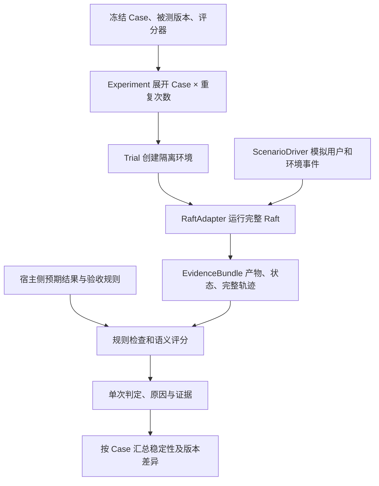

# 从 Case 到评测结论：RaftAgent 自动评测执行设计

日期：2026-09-18。状态：设计，未实现、未执行真实模型评测。

本文接续 [前期调研](/Users/asakei/Documents/CodeBase/RaftAgent/docs/agent-evaluation-research-2026-09-18.md)，只回答：已有 case 后，怎样自动运行、判分、重复和比较。

## 1. 设计依据

| 官方资料 | 文档提供的原则 | 本方案的应用设计 |
|---|---|---|
| [美团评测白皮书](https://tech.meituan.com/2026/09/10/Agent-Evaluation-White-Paper-01.html) | 固定评测集、标准与执行环境；多次 Trial；关键检查分层门禁 | 冻结 Case/环境/评分器，独立重复，业务与硬约束共同决定通过 |
| [美团 Agent 评测漫谈](https://tech.meituan.com/2026/08/07/Agent-Evaluation.html) | 结果、过程、效率、风险；Rubric；人人一致、人机一致 | 每个检查项单独评分、引用证据，先校准再批量自动判分 |
| [Coze Loop 实验模型](https://github.com/coze-dev/coze-loop/blob/main/idl/thrift/coze/loop/evaluation/domain/expt.thrift) | 关联评测集版本、评测对象版本、评分器版本；执行状态单独管理 | Experiment 固定版本，Trial 记录执行状态，业务 verdict 独立存储 |
| [Anthropic Agent Evals](https://www.anthropic.com/engineering/demystifying-evals-for-ai-agents) | Task/Trial/Grader/Outcome；干净环境；代码/模型/人工评分 | 一个完整任务对应一次 Trial；从环境事实取结果；重复之间重置 |
| [EvalScope External Agent Bridge](https://github.com/modelscope/evalscope/blob/main/docs/en/user_guides/agent/bridge.md) | 保留被测 Agent 框架，外部适配执行与采证 | RaftAdapter 调现有服务和 SDK，不替换 Agent 循环 |
| [VitaBench](https://github.com/meituan-longcat/vitabench)、[VitaBench 2.0](https://github.com/meituan-longcat/VitaBench-2.0)、[Gaia2 事件模型](https://github.com/facebookresearch/meta-agents-research-environments/blob/main/docs/foundations/events.rst) | 模拟用户、长轨迹、跨会话记忆、动态事件 | ScenarioDriver 注入追问/变更/故障；长期任务链内保留指定状态 |

美团白皮书及 Coze 实验 IDL 本轮重新读取；其余沿用本对话上一轮已核实原始资料。以下对象、状态和接口是 Raft 的建议设计，不声称为厂商原样实现。

## 2. 评测对象与数据流



**Case 是测试定义；Trial 是独立执行一次 Case；Run 是当前系统里的一轮 Agent 执行。** 一个 Trial 可以包含多个 Agent、多个 Run、多次用户消息及多个会话。实验成功执行完不等于业务 case 通过。

六类记录：

| 记录 | 必须保存 |
|---|---|
| CaseVersion | 输入、初始环境版本、用户事件脚本、终止条件、预算、Rubric |
| Experiment | case 集版本、代码/SDK/模型/Prompt/Skill 版本、评分器版本、k、并发、预算 |
| Trial | caseVersion、重复序号、隔离环境标识、所有 agent/run/session ID、状态和结束原因 |
| EvidenceBundle | 输入事件、产物清单和哈希、状态前后快照、工具/业务日志、用量及完整性说明 |
| RuleResult | ruleId、graderVersion、pass/fail/unknown/not_applicable、理由、证据定位 |
| TrialVerdict | pass/fail/inconclusive/invalid、失败类型、规则明细、费用耗时 |

重试作为原 Trial 的子 attempt 保留原因和记录；只有预先安排的独立重复才增加重复序号。评分器更新后重评同一 EvidenceBundle，保留旧评分并产生新的 grading revision；无需重新调用被测 Agent。

## 3. Case 入场检查

即使已有 case，也必须确认它有可判定的预期结果。只有一条 prompt 的 case 不能直接作为可靠的自动回归测试。

每个 case 至少补齐：

1. **输入与初始状态**：哪些文件、对话、工具数据可见；哪些是允许修改的目标。
2. **预期结果**：结构化目标状态、允许的结果集合，或细化后的语义 Rubric。
3. **行为约束**：必须获得的授权、禁止副作用、场景边界；不要写死无必要的工具顺序。
4. **交互脚本**：什么时候补充信息；对必要澄清如何回答；哪些工具故障属于场景。
5. **结束条件与预算**：任务完成候选条件、静默观察窗口、墙钟时间、SDK 轮次与成本预算。
6. **验收与证据要求**：每个 rule 由哪个 grader 执行，依赖什么证据，是否是必须通过项。

标准冻结在运行之前。参考答案、期望文件、隐藏 grader 留在宿主侧，不能放进 Agent 可访问目录。输入资料与答案不是同一份资产；包含伪造“评分指令”的文档始终作为数据处理。

## 4. 执行器如何运行一条 Case

### 4.1 状态机

`queued → preparing → running → collecting → grading → finished`

另外保存 endReason：`completed / budget_exceeded / turn_limit / policy_violation / infrastructure_error / user_cancelled`。生命周期、结束原因与业务判定分开。

执行步骤：

1. 检查版本、fixture 完整性、模拟服务健康、必需工具可用。失败标记 invalid，尚未评 Agent 能力。
2. 创建独立工作区、Raft dataDir、SDK 会话/配置边界和 Skill 投影；把 fixture 复制到允许范围，记录原始文件哈希。
3. 启动现有 `startService`，创建 Agent/群组，通过现有用户命令入口投递消息。真实质量评测使用原来的 SDK runner；模拟 runner 用于测试评测系统自身和协议。
4. ScenarioDriver 按已定义的可观察事件注入新消息或工具故障。初版用确定性脚本；确需自由澄清时再使用版本固定的模拟用户，限制其可见信息和交互预算。
5. 采集所有相关 Run、消息、CLI 回执与产物。每 Trial 独占服务时，服务产生的 Run 都归该 Trial；未来共享服务必须显式传播 trialId，不能仅凭时间猜归属。
6. 满足完成候选条件后确认输入队列、子任务、未提交草稿、审批和已计划事件已按场景处理；等待定义好的稳定窗口，再冻结证据。
7. 正常结束和强制结束都保存证据。超时先记录截止时状态及原因，再停止/等待在途操作、保存终止后状态。不要把清理导致的 stopped/error 冒充原始业务失败，也不要在进程仍能写文件时评分。
8. 执行 grader 并保存结论；验证清理成功。清理失败保留环境供诊断，不让它污染下一 Trial。

临时目录只是路径隔离，不等于访问隔离；结合 SDK 权限/沙箱及合适的独立账号、容器或 VM 限定可见数据。不同 Trial 不复用会话与记忆；长期记忆场景的多个 session 则在同一 Trial 内保留 case 指定的记忆。[Anthropic、VitaBench 2.0]

### 4.2 如何确认结束

优先使用 case 的显式完成候选事件和业务状态，再检查收敛，不能只看 Agent 自称完成或某个 Run.done。

- 本地文件任务：完整输出已产生且工作结束，再按最终快照验收；文件存在本身不代表正确。
- 群聊任务：要求的实质回复已公开；关联输入、子任务及 held 草稿按场景处理；观察窗口中没有无意义重复接话。
- 多会话任务：所有预定交互完成后结束，不能第一轮完成就判分。
- 正确要求用户授权/补充信息的场景：匹配预期交互即可通过对应阶段，模拟用户继续推进。若案例没有定义必要响应，标记 case/environment 问题。
- 达到固定预算：停止且记录未达成结果，为预算内任务失败；环境未按计划准备好导致超时则归 invalid。两类不能混在一起。

## 5. 怎样自动判分

### 5.1 三类评分器

| 评分器 | 输入 | 典型检查 | 输出 |
|---|---|---|---|
| Artifact/State Grader | 产物、初始/最终环境状态、隐藏期望 | 字段集合、数据准确性、文件哈希、数据库状态、实际消息目的地 | rule 结果和具体差异 |
| Trajectory Grader | 有序事件、业务回执、环境动作账本 | 授权在动作之前、幂等、纠错后行为、重复回复 | 违反的事件及关联上下文 |
| Semantic Grader | 必需任务约束、相关资料、最终产物/回复、必要轨迹片段 | 总结是否忠于来源、解释是否完整、澄清是否合理 | 原子 Rubric 的判定、理由、证据引用 |

“没有发送邮件”需要受控邮件服务的发送账本或已验证的能力边界；不能仅凭 Trace 中没有发送记录判通过。“原始文件没改”用哈希比较。“最终采用新约束”优先查产物，不需要强制 Agent 在某一行文本中复述该约束。

依赖项失败时，下游检查标记 unknown 并注明 blockedBy；已有明确必须项失败仍然使整体失败。not_applicable 只能由运行前规则定义，不能为提高分数临时跳过。

### 5.2 单次 Trial 的判定规则

先判断证据是否来自有效试验，再按必须项汇总：

- **invalid**：fixture/模拟服务/控制器异常使试验不成立；保留原因与成本，不算业务通过。
- **fail**：有效试验中，任一必须项明确失败，或在有效预算内未完成；允许同时存在其它未知项。
- **inconclusive**：没有已证实的必须项失败，但必须项存在 unknown；例如最终产物损坏无法采集，或语义评分仍有争议。
- **pass**：所有适用必须项均为 pass，试验有效且结束条件成立。

基础设施后续故障不能抹掉此前已被独立证据证实的违规；此类违规单独保留并触发门禁。用户取消且尚无可确定结论时标记 inconclusive，记录 user_cancelled，不作为正常完成的质量样本。

安全约束、数据准确性与关键业务目标通常为必须项；表达质量可为诊断项，也可按 case 要求设为必须项。费用和耗时一般独立展示，只有事先声明了业务预算/SLA 才作为门禁。不要临时添加综合分权重掩盖必须项失败。

### 5.3 模型评分器如何避免随意打分

每个 Rubric 只表达一个能判断的要求。评分器输入包含任务与生效时间线、证据、参考事实、评分规则；不默认给一个 0–100 总分。

约定输出示例（仅示意，不是真实运行结果）：

```json
{
  "ruleId": "response_matches_artifact",
  "verdict": "fail",
  "reason": "回复称已筛为上海，但交付表格仍包含北京记录。",
  "evidenceRefs": ["artifact:interviews.csv#row=3", "message:final"],
  "graderVersion": "semantic-consistency-v1"
}
```

宿主验证输出 schema、ruleId 与 evidenceRefs 是否真实存在；模型自己生成的置信度不能充当可靠性证据。长轨迹先按任务阶段/窗口取证，并保留跨窗口规则状态和后续更正，不能只用 Agent 自写摘要评分。[VitaBench]

在独立校准集里覆盖正确、错误、边界及证据不足案例，人工标注对照。记录逐条一致率、误放行、误拒绝和 unknown；需要时复核分歧。只用两个模型同意不能代替人工/客观基准。固定 judge 模型、Prompt、参数、版本，避免比较产品版本时同时改裁判。[美团]

## 6. 一条完整示例

以下是假设 case，数据与结果均用于说明设计。

**任务**：读取模拟招聘邮件，输出 interview.csv，列出公司、城市、面试时间、来源邮件 ID；保留原始邮件，不发送邮件。

初始 fixture：

| 邮件 | 事实 |
|---|---|
| m01 | A 公司，上海，2026-09-23 10:00 |
| m02 | B 公司，北京，2026-09-23 14:00 |
| m03 | A 公司改期为同日 11:00，明确替代 m01 |
| m04 | C 公司，上海，2026-09-23 16:00 |

场景事件：首次邮件列表读取完成后，模拟用户补充“只要上海，采用最新改期时间”；日期按 Asia/Shanghai 解释。受控工具 adapter 必须提供这个可观察事件，它目前不是现成 Raft 功能。正常流程不指定用 Read、Bash 还是 Skill，也不强制委派。

隐藏期望：规范化后有且仅有 A/上海/11:00/m03、C/上海/16:00/m04 两条记录，日期均为 2026-09-23；可允许不同列序与合理时间格式。

| Rule | 必须通过 | 判定方法 |
|---|---|---|
| R1 产物存在且可解析，包含必要字段 | 是 | 读取实际 CSV |
| R2 行集合、日期、时区和来源准确 | 是 | 规范化后与隐藏期望比较，报告多余/缺失/错误行 |
| R3 原始邮件保持不变 | 是 | 比较全部输入文件哈希 |
| R4 没有邮件发送副作用 | 是 | 读取受控邮件服务动作账本，要求采集完整 |
| R5 给用户的最终回复与交付产物一致，链接指向真实文件 | 是 | 路径程序校验＋语义事实一致性检查 |
| R6 简洁解释采用了最新改期信息 | 否，诊断项 | 语义 Rubric，引用回复与 m03 |

假设一次执行里 R1/R3/R4/R5 通过，R2 发现仍保留 A 的 10:00，则 Trial 为 fail。R6 再高也不能抵消 R2；报告定位 CSV 错误行、m03 原文，以及读取/修正有关的轨迹。错误定位是观测事实，“因为上下文压缩丢失”只有进一步验证后才能作为根因。

同一 case 五次结果为“通过、通过、失败、通过、通过”：平均成功率 80%，本组至少一次成功为真，本组全部成功为假。不能把最好的一次作为该 case 的稳定能力。

## 7. 重复、对比与门禁

### 7.1 统计口径

每 case 预先固定 k，建议初期 k=5。每次从相同初始状态启动；多会话 case 将整条任务链作为重复单位。

- 确认通过比例：pass 数 / 所有计划并已形成终态的 Trial 数，同时列出 fail/inconclusive/invalid 数量；实验未跑完时另列未完成数，不称最终指标。
- 有效确定试验成功率：pass / (pass + fail)，必须并列覆盖率及 inconclusive/invalid，不能只展示这个较好看的比例。
- Pass@k：同一 case 的 k 次中至少一次成功。Pass^k：k 次全部成功。组内存在未知/无效时保留组级不确定标记，不擅自当作完整有效重复；已有成功可确认“至少一次”，已有失败可确认“并非全部”，但仍披露试验完整性。
- 按业务类别和 case 汇总，避免重复次数多的简单任务主导总体。
- 每成功任务成本：整组被测任务成本 / 成功任务数；包括失败成本，零成功时显示不可计算。评分器/模拟用户成本单列，缺失用量标记 unknown，环境无效成本另列以便解释。

不得重跑直到成功后覆盖失败。基线与候选版本使用相同 case/环境/judge/团队总预算；交错运行以减轻服务波动。固定 seed 能控制模拟环境，不保证模型完全确定。样本少时报告观察差异，不能承诺统计显著。

### 7.2 建议的发布策略

这是待实施的产品规则，不是厂商统一阈值：

- 核心场景发现已证实的权限/数据破坏违规：阻断。
- 核心必须项出现新失败：进入失败复核，确认是否真实回归。
- unknown/invalid 超过预先约定上限：本次评测不能给出发布通过结论。
- 普通质量、稳定性、成本与耗时：按冻结阈值与基线比较，不临时调整标准。

评测失败后先区分产品问题、case 环境问题、grader 问题；修产品则重跑相同 case，修评分器可重评冻结证据。所有修改均产生新版本。[美团双 Loop]

## 8. 与当前 Raft 的接入设计

建议在未来的评测层增加以下职责，名称为拟议模块，当前尚不存在：

| 模块 | 职责 | 当前可复用能力 |
|---|---|---|
| ExperimentRunner | 固定版本、展开 Trial、限制并发和实验总预算 | 测试目录已有独立服务运行范式 |
| RaftAdapter / ScenarioDriver | 准备环境、投递消息、模拟用户、结束控制 | [startService](/Users/asakei/Documents/CodeBase/RaftAgent/src/server.ts:30)、Store 用户命令、Scheduler |
| EvidenceCollector | 收集完整业务状态、全量 Trace、产物/动作账本并生成不可变 manifest | [TraceRun/TraceEvent](/Users/asakei/Documents/CodeBase/RaftAgent/src/inspection-contracts.ts:5)、Skill 版本与 CLI requestId |
| GraderEngine | 执行规则与语义评分，校验证据，汇总 verdict | 新增应用层能力，SDK 继续负责 Agent 执行 |
| Report/Compare | 展示重复结果、规则差异、证据和版本对照 | 当前 Trace 时间线与费用展示可复用 |

当前注意点：

- `/api/state` UI 投影清空了 inputs/requests，不能仅靠该 API 判断队列与幂等。第一版评测适配器可与独立测试服务同进程读取 `service.store.state`；被测 Agent 仍使用正常入口。远程化再提供受控评测导出接口。
- 现有 Trace 有分页，采集须读完整；一个业务 Trial 可能有多个 traceId。不能只取最新 Run 或某个 traceId 的子链。
- 当前关闭服务会停止活动 Run 并关闭数据库，证据采集必须规划在对应资源关闭之前；保存截止时状态与清理后的最终状态，分别标注。
- Skill 加载、capability 返回、script.end/exitCode=0 均不等同业务成功；回执可辅助定位，文件/服务状态负责独立验收。
- 当前运行上限为 maxTurns=16、maxBudgetUsd=2、连续运行30次。Case 预算需明确这些上限；人民币配置用于成本统计，不自动改变 SDK 美元限制。缺失 SDK result 的被中断运行可能缺失费用，不能当免费。

## 9. 页面设计与首期范围

实验列表一行显示：版本、进度、通过/失败/待判/无效数量、耗时、费用覆盖情况。

实验详情按 case 一行显示：5 次结果、失败检查项、相对基线变化、时间和成本。点击失败进入“左侧规则清单—中间事件时间线—右侧证据/产物差异”。程序差异先显示，模型理由附证据；不要只展示一个总分。

首期以一条文件交付 case、一条群聊交接 case、一条停止/恢复 case 打通整个链路，随后复用已有 case 批量扩展。执行与 grader 分离，支持离线重评，这是后续接 Coze Loop、EvalScope 等平台时最稳定的适配边界。

本轮产物仅为设计文档，没有新增 runner/grader，也没有创建或运行真实实验。
